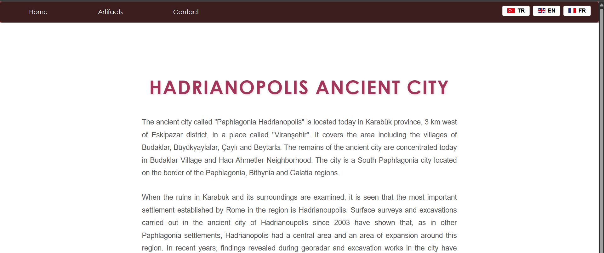
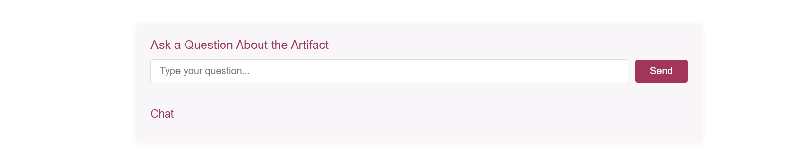

  
  
  

  # 🏛️ Virtual AI Guide for Hadrianopolis Ancient City
  
  

    <b>An AI-powered interactive guide transforming historical tourism with Large Language Models (LLM).</b>
     
    <i>Senior Design Project - Supported by TÜBİTAK</i>
  

   

  

    

---

### 🔒 Project Status & Confidentiality
> **Note:** This repository serves as a **portfolio showcase**. Since this project is actively deployed as a commercial/public service and supported by **TÜBİTAK**, the source code remains **private** to protect intellectual property and security infrastructure. Below are the technical details, architecture, and features of the system.

---

### 📖 Executive Summary
This project is a **next-generation digital tourism assistant** developed for the Ancient City of Hadrianopolis. Unlike traditional audio guides, this system utilizes **Generative AI (LLM)** to allow visitors to have a "conversation" with history.

Visitors scan **QR codes** placed on artifacts and can ask specific questions like *"Who built this structure?"* or *"What was this room used for?"* receiving instant, historically accurate, and dynamic responses.

---

### ✨ Key Features

| Feature | Description |
| :--- | :--- |
| **🤖 AI-Powered Q&A** | Integrated with **Large Language Models** to understand natural language questions and generate context-aware historical facts. |
| **📱 QR Code Integration** | A seamless physical-to-digital bridge. Each artifact has a unique QR entry point mapped in the database. |
| **⚡ Scalable Backend** | Built with **.NET MVC** and **PostgreSQL** to handle concurrent requests from hundreds of tourists simultaneously. |
| **🛡️ Admin Dashboard** | A secure panel for archaeologists/admins to update artifact information, view query logs, and manage QR mappings. |
| **🌍 Real-World Impact** | Currently **deployed and actively used** by visitors in Hadrianopolis, enhancing the educational value of the site. |

---

### 🛠️ Tech Stack & Architecture

**Backend & Database**

**AI & Integration**

**DevOps & Tools**

---

### System Previews

Since the code is private, here are glimpses of the running application:

| Visitor Interface | Admin Control Panel |
| :---: | :---: |
|  |  |
| *Visitors ask questions via chat interface* | *Admins manage content and prompts* |

---

### 🏆 Acknowledgments
* **TÜBİTAK:** For supporting the research and development phase of this project.
* **Karabük University:** For academic guidance during the Senior Design Project process.

---

  
<i>Developed by <b>Sema Nur Zorlu</b></i>

  

